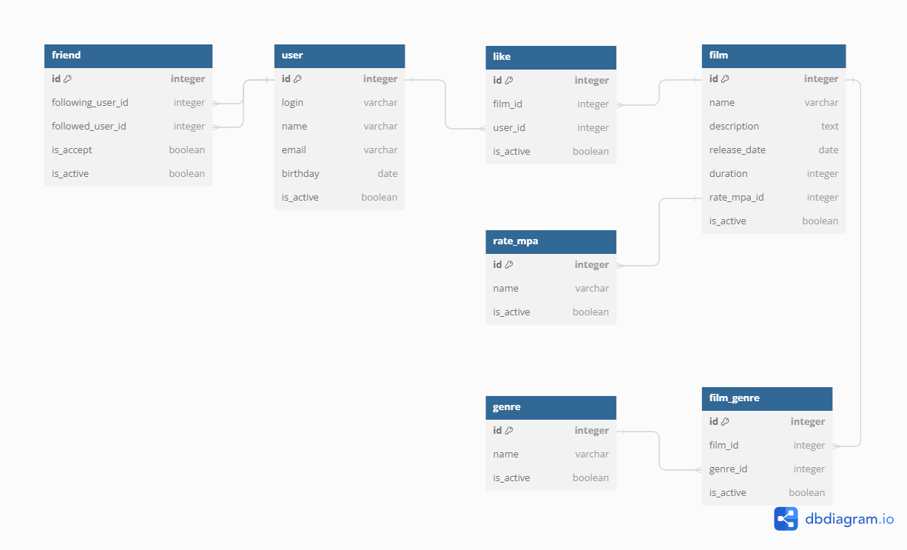

# java-filmorate
Template repository for Filmorate project. 
Schema Data Base for project. 

Examples:  
get user: 

    select *
    from users
    where id = ${id} and is_active

get all users: 

    select *
    from users
    where is_active

get friends user: 

    select u.*
    from users u
    left join friends f on f.followed_id = u.id and f.is_active
    where u.is_active and f.following_id = ${id}

get film: 

    select *
    from films
    where id = ${id} and is_active

get all films: 

    select *
    from films
    where is_active

get film sorted rate: 

    select f.*, r.rate
    from films f
    left join (
        select count(distinct r.user_id) rate, r.film_id
        from rate r        
        where r.is_active
        group by r.film_id
        ) r on r.film_id = f.id
    where f.is_active
    order by r.rate desc